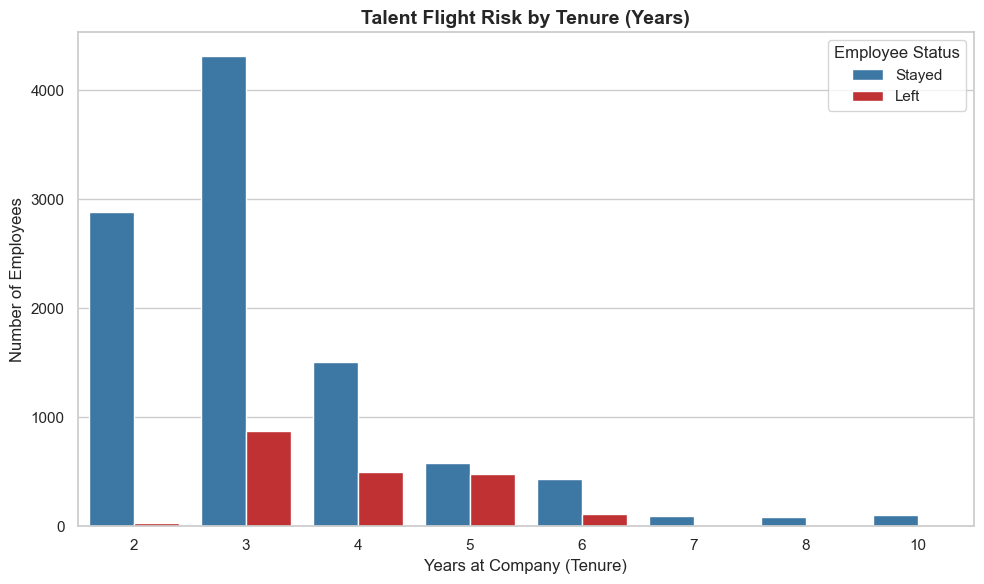
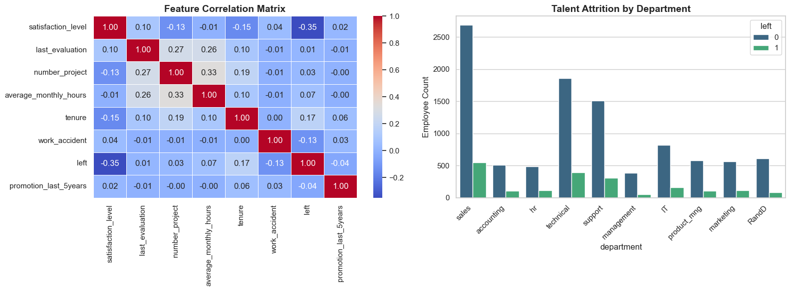
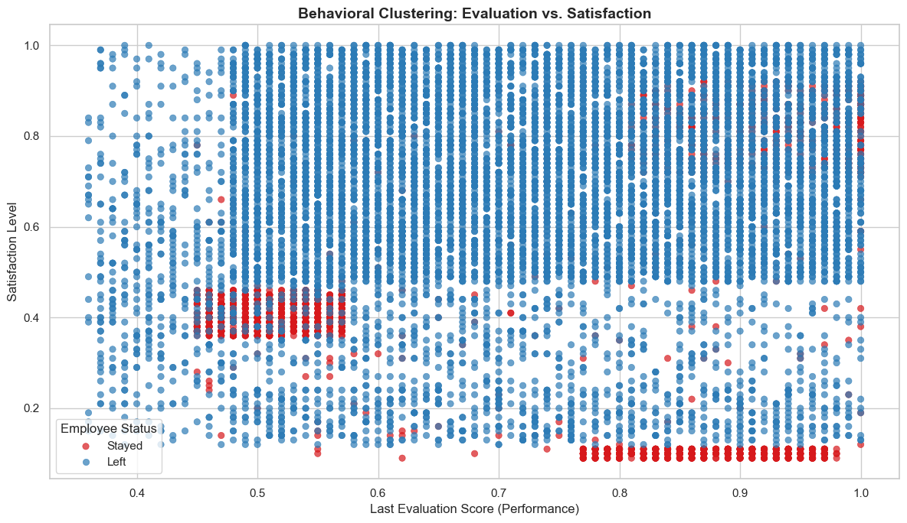
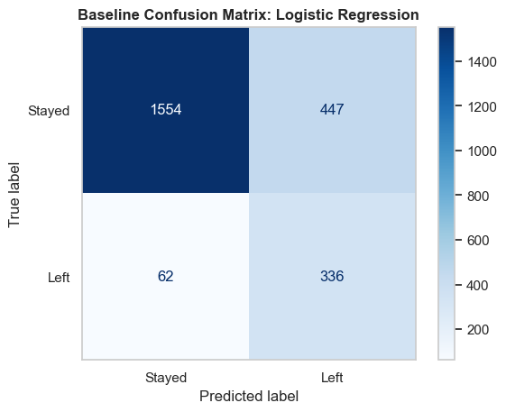
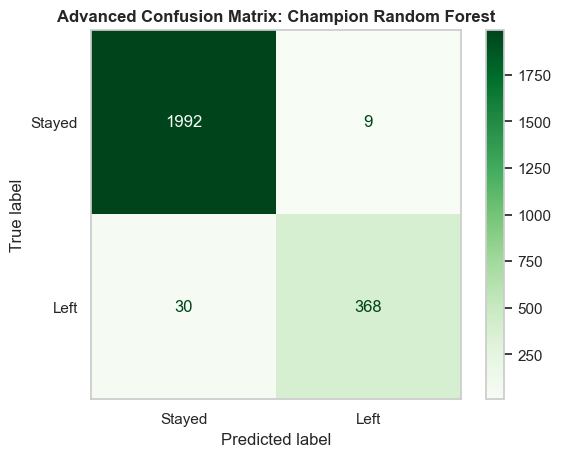
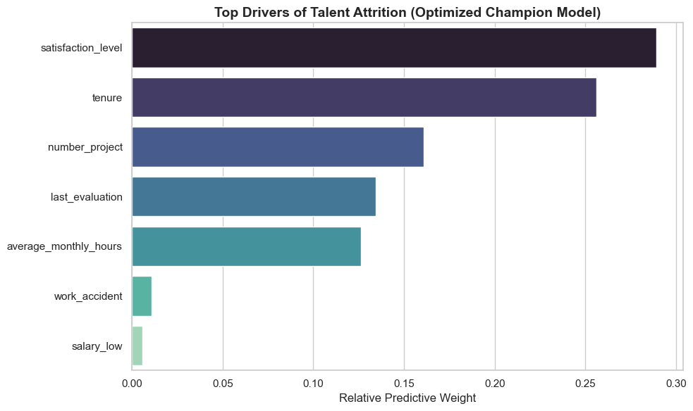

# Predictive HR Analytics & Risk Mitigation Pipeline - A study of Employee Retention in Salifort Motors
**Author: Navneet Wadhavane | Target Output: Enterprise BI Ingestion**

### Introduction:
This project is aimed to identify the factors influencing employee turnover at Salifort Motors, a fictional alternative energy vehicle manufacturer. Here, I analyzed the human resources data, which included variables such as monthly working hours, number of projects, promotion status, department, and salary. I executed a structural audit to identify nulls, standardized nomenclature, and performed Exploratory Data Analysis (EDA) using Python packages such as Numpy, Pandas, Matplotlib, and Seaborn.

I've then created baseline and advanced classification models, namely Logistic Regression and an Optimized Random Forest Classifier, to correctly classify employees who'll leave or stay in the company. Then I evaluated the models using metrics such as accuracy, recall, precision, f1 score, and confusion matrix. Finally, I translated the findings into actionable operational levers and presented the recommendations for Salifort's Senior Leadership team and Human Resources (HR) team for Enterprise BI Ingestion.

### Employee Retention:
Employee retention refers to the ability of a company to prevent employee turnover. In other words, it is the company's concerted efforts to retain their existing staff and keep their best employees on board in order to succeed as a business. Employee retention is often expressed as a statistic; the percentage of employees that remain in a company for a fixed time period (e.g. a quarter). 

As businesses compete for top talent, employee retention is crucial. The ability to retain employees is universally beneficial for many reasons:
1. Employee retention is a high priority for leading HR organizations today.
2. The most effective employee retention strategies reduce overall turnover and keep high performers on board.
3. A thoughtful and comprehensive employee retention strategy reduces the high costs associated with replacing lost employees.

The Human Resource department at Salifort Motors wants to take some initiatives to mitigate risk and improve employee satisfaction levels. Predicting which employees are likely to quit might help the company to identify the true operational catalysts that contribute to their leaving.

### Tools used:
1. Python for Exploratory Data Analysis, Data Partitioning, and building machine learning models.
2. Jupyter Notebook environment for pipeline execution.

### Methodologies used:
1. Exploratory Data Analysis (Bivariate and Multi-way Variance)
2. Descriptive Statistics & Data Leakage Audits
3. Feature Space Engineering (One-Hot Encoding)
4. Baseline Logistic Regression model
5. Random Forest Classifier (GridSearchCV Optimization)

The entire project from collecting and validating the data, exploratory data analysis, building machine learning models to predict employee churn and communicating the results to the stakeholders is based on the PACE workflow. PACE is an acronym; each one of the letters represents an actionable stage in a project: plan, analyze, construct, and execute.

---

### (P)ACE - PLAN - UNDERSTANDING THE DATA IN THE PROBLEM CONTEXT

**Statement of the Business Task:**
The purpose of this project is to ingest raw HR data, conduct a strict data leakage audit, and establish the structural integrity of a predictive pipeline. Our goal is to analyze the key variables driving talent flight risk, build an advanced predictive engine, and share strategic recommendations for Enterprise BI deployment.

**About the Data Set:**
This project uses a dataset called `HR_capstone_dataset_original.csv`. It contains 14,999 rows of self-reported information from employees and 10 columns. 

**Data Integrity:**
During the initial structural audit, we detected 3,008 duplicate rows. To prevent model overfitting, these structural duplicates were dropped, resulting in a sanitized array of 11,991 rows. Furthermore, a strict Data Leakage Audit was conducted to confirm no post-attrition variables (like severance pay or exit interview scores) existed in the feature space. All remaining features were validated as pre-attrition indicators.

---

### P(A)CE - ANALYSIS - EDA, SIGNAL EXTRACTION & BASELINE MAPPING

**Summary of the Exploratory Data Analysis:**
1. **The Burnout Metric:** The mean working hours sit at ~201 per month. Assuming a standard 176-hour work month, the average employee is actively working overtime. The maximum is a brutal 310 hours (nearly 14 hours a day).
2. **Evaluation Floors:** Employee satisfaction ranges completely from 0.09 to 1.0, but the absolute minimum performance evaluation is 0.36. We have a truncated distribution here—no one is scoring near zero, suggesting underperforming employees are either terminated or leave before generating lower scores.
3. **The Danger Zone:** The vast majority of turnover happens strictly between years 3 and 5. Year 3 is the primary breaking point. If an employee survives past year 6, attrition effectively drops to zero.

4. **The Satisfaction Inversion:** The correlation matrix reveals a mathematically significant negative correlation (-0.35) between `satisfaction_level` and attrition. This is our primary leading indicator.
5. **The Workload Interaction:** `number_project` and `average_monthly_hours` show a strong positive correlation (0.33). Stacking projects forces overtime and drives up burnout. Employees with 7 projects invariably leave.
6. **High-Risk Nodes:** Attrition is not evenly distributed. The Sales, Technical, and Support departments represent the highest raw volume of talent flight risk.

7. **Behavioral Clustering:** A scatterplot mapping evaluation vs. satisfaction revealed three distinct attrition clusters. The most critical risk node is the "Burnout" cluster: top performers with evaluation scores > 0.8 who have completely collapsed in satisfaction. Salifort is actively bleeding its highest-performing talent.

**Recommendations based on EDA:**
1. Retention budgets should not be spread thinly across the entire company. HR interventions must be surgically targeted at engineers approaching their 3rd work anniversary.
2. Over-leveraging engineering talent yields short-term project velocity but introduces massive tail risk. Project volume must be managed to prevent burnout.

---

### PA(C)E - CONSTRUCT - FEATURE SPACE ENGINEERING AND EVALUATE MODEL

**Steps taken to build the models:**
1. Apply One-Hot Encoding to categorical variables (`department`, `salary`), using `drop_first=True` to prevent perfect multicollinearity.
2. Isolate the target variable (`left`) and partition the data into 80% training and 20% testing sets using stratified splitting (`stratify=y`) to handle the class imbalance.
3. Create a Baseline Logistic Regression model (using `class_weight='balanced'`).
4. Execute Grid Search (`GridSearchCV`) to optimize hyperparameters (depth, estimators, splits) for an advanced Random Forest Classifier.
5. Evaluate model performance via Classification Reports and Confusion Matrices.

**Evaluation metrics:**
We used Accuracy, Recall, Precision, and F1 Score. We heavily prioritized the **F1 score** as it provides a harmonic mean of precision and recall. Because our target class is imbalanced (approx 83.4% stayed vs 16.6% left), maximizing the F1 score ensures we correctly identify the employees at risk of leaving (True Positives) without generating excessive false alarms.

**Results of the models:**

| Model | Accuracy | Recall (Left) | Precision (Left) | F1 Score (Left) | Confusion Matrix (Left correctly predicted) |
| :--- | :--- | :--- | :--- | :--- | :--- |
| **Baseline Logistic Regression** | 0.79 | 0.84 | 0.43 | 0.57 | 336 (out of 398) |
| **Champion Random Forest** | 0.98 | 0.92 | 0.98 | 0.95 | 368 (out of 398) |

The Advanced Random Forest model vastly outperformed the baseline, mapping optimal decision boundaries to achieve an F1 score of 0.95 and an overall accuracy of 98%.

---

### PAC(E) - EXECUTE - INTERPRET MODEL AND SHARE STORY

**Summary of the analysis:**
1. We established a sanitized predictive pipeline on 11,991 clean HR records.
2. We generated an optimized Random Forest Champion model that correctly classified 98% of overall employee retention statuses.
3. Extracted Feature Importances conclusively proved that `satisfaction_level`, `tenure`, and `number_project` are the top three drivers of talent attrition.

4. **Compensation is a Distraction:** The model definitively proves that low salary (`salary_low`) has near-zero predictive weight. Throwing money at the problem will not fix the churn.
5. **The True Catalysts:** Attrition is driven by a compounding cycle of operational strain—specifically, tenure stagnation intersecting with project stacking.

**Recommendations:**
To stop the bleeding of our top talent, management does not need a bloated compensation budget; they need strict project governance and targeted career interventions. 

1. **The Tenure Check-In:** Implement mandatory, high-touch career trajectory reviews for engineers approaching the high-risk tenure milestones (Years 3 to 5). Focus on internal mobility rather than just compensation.
2. **Project Governance (Variance Cap):** Establish a strict operational cap on `number_project`. The data indicates that assigning more than 4 concurrent projects exponentially increases average monthly hours and triggers severe flight risk.
3. **Dashboard Deployment:** Integrate this predictive logic into a live PowerBI dashboard for HR Managers, automatically flagging employees in the top 10% of risk probability for preemptive retention measures.

**Limitations of the project:**
1. **Class Imbalance:** Our dataset natively contains an 83/17 split between retained and churned employees. While stratified splitting and balanced class weights were used, minority class extraction is always mathematically harder in imbalanced arrays.
2. **Lack of Financial Context:** Salary is only represented categorically (low, medium, high). Replacing this with continuous numerical compensation data could potentially reveal deeper, more nuanced financial correlations that our current model deems "noise."